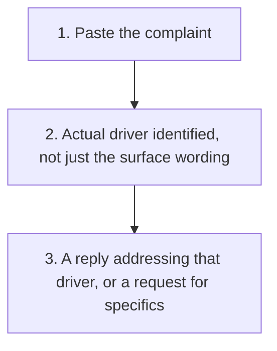

# Diagnose Before You Respond

  
  

Diagnose what is actually driving a customer complaint before drafting a reply, rather than answering only the surface wording.

## Why

Some complaints are exactly what they say, a real, specific fault that just needs fixing. Others say one thing on the surface while the real driver is something else, usually that nobody acknowledged the issue until the complaint was made. Answering the wrong one of these, over-explaining a simple fault, or under-addressing a real underlying frustration, gets the reply wrong either way.

## Use It

Copy [SKILL.md](SKILL.md) and paste it into your AI tool (ChatGPT, Claude, Gemini, or similar), then paste in the complaint. It identifies which is the closest fit, genuine fault, feeling unheard, an expectation mismatch, or a pattern worth checking, and drafts a reply addressing that specific driver.

<strong>See exactly what it produces</strong>

1. The diagnosis: which of the four drivers actually fits, and why
2. A drafted reply addressing that specific driver, not just the surface wording
3. Where the complaint is too vague to diagnose, a request for the minimum missing detail instead of a guess

See [the worked example](example/worked-example.md): two fictional complaints to a small bakery, one a genuine, simple fault that should not be over-diagnosed, one where the real complaint is not the stated issue but the lack of a heads-up about it. For the harder cases, an accurate description mistaken for a fault, and a complaint too vague to diagnose at all, read [the second worked example](example-two/worked-example.md).

Use [the review checklist](checks/checklist.md) before sending any reply.

No installation, project, or coding required to try it once.

## Scope

This is deliberately narrow: customer complaints specifically, not general workplace conflict or negotiation, where the right diagnosis needs more context than a single message provides.

## Before You Use It

This drafts a reply and proposes a diagnosis. Sending anything, and any compensation offered, stays subject to explicit human approval.

## Licence

MIT.

## Feedback

Used it on a real complaint? [Start a discussion](https://github.com/shaunmarsden/diagnose-before-you-respond/discussions) if the diagnosis did not fit.

## Part of a Family

This is one of a family of free tools generalising [practical-ai-sales-workflows](https://github.com/shaunmarsden/practical-ai-sales-workflows) patterns beyond sales. See [sibling-projects](https://github.com/shaunmarsden/sibling-projects) for the rest, or use [the router](https://github.com/shaunmarsden/sibling-projects/blob/main/ROUTER.md) if you are not sure which one actually fits.
